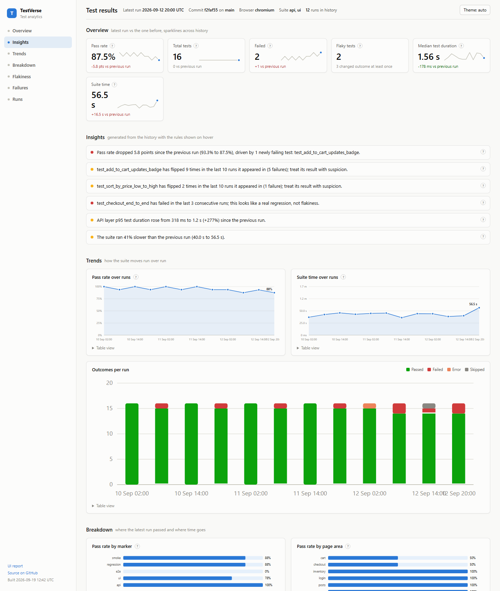
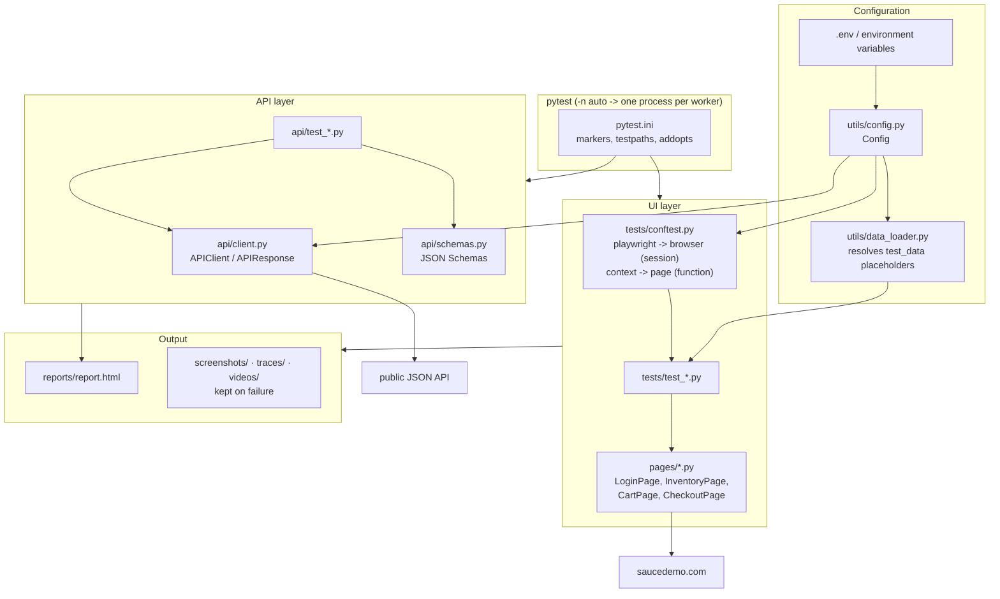

# TestVerse

[](https://github.com/khushi-git-7/Saucedemo-playwright-framework/actions/workflows/ci.yml)
[](https://www.python.org/)
[](https://playwright.dev/python/)
[](#license)
[](https://khushi-git-7.github.io/Saucedemo-playwright-framework/)

A UI and API test automation framework for [saucedemo.com](https://www.saucedemo.com/),
built with **Playwright (sync API) + Pytest**.

It is a working reference for how a small automation suite is put together in
practice: page objects for the UI, an HTTP client for the API, environment-driven
configuration, parallel execution, failure artifacts (screenshot + trace + video),
HTML reporting, a Docker image and a GitHub Actions pipeline.

---

## What it covers

**UI (Playwright)** - login (data driven, including locked-out and empty-field
cases), inventory listing and price sorting, cart add/remove/badge count, and the
end-to-end checkout journey.

**API (requests + jsonschema)** - status codes, JSON Schema contract validation,
response-time assertions and negative cases against
[jsonplaceholder.typicode.com](https://jsonplaceholder.typicode.com).

---

## Dashboard

Every pytest run leaves a JSON record under `reports/history/`. The dashboard
turns that history into a single self-contained analytics page, published by CI
to GitHub Pages after every push to `main`:

**Live:** https://khushi-git-7.github.io/Saucedemo-playwright-framework/



| Panel | What it shows |
|---|---|
| **Overview** | Pass rate, total tests, failures, flaky count, median test duration and suite time for the latest run, each with its delta against the previous run and a sparkline across history. |
| **Insights** | Findings computed from the history, in plain English, with the rule shown on hover: a pass-rate drop and the tests that caused it, tests that flip between passing and failing (flaky) versus tests that fail consistently (a real regression), p95 duration jumps per layer, and suite slow-downs. |
| **Trends** | Pass rate and suite time over runs; stacked outcomes per run. Every chart has a table view. |
| **Breakdown** | Pass rate by marker (smoke, regression, e2e, ui, api) and by page area; the slowest tests with p50 / p95 / max across history. |
| **Flakiness** | Tests whose outcome changed within the recent window, with a flip count and a pass/fail strip timeline per test. |
| **Failures** | The latest run's failures with phase, message and links to the screenshot, trace and video that were captured. |
| **Runs** | Every recorded run: timestamp, commit, browser, workers, pass rate, duration. |

How flakiness is decided: a test is flaky when its outcome flipped at least
twice within the last 10 runs it appeared in. A test that has failed in three or
more consecutive runs is reported as a regression instead, because a steady
failure is not flakiness.

Build it locally from your own runs:

```bash
python -m pytest -m smoke                 # records reports/history/<run>.json
python -m pytest -m smoke                 # a second run gives the deltas something to compare
python -m utils.dashboard                 # -> reports/dashboard.html
```

Or from generated sample data to see every panel populated:

```bash
python -m utils.dashboard.demo --runs 12
python -m utils.dashboard --history reports/history-demo
```

Constraints, all deliberate: one HTML file, inline SVG charts generated in Python,
no external scripts, styles or fonts, light and dark themes, no new runtime
dependency. It opens from disk, from a CI artifact, or from GitHub Pages.

The recorder is `utils/results_plugin.py` (registered in the root `conftest.py`).
`TESTVERSE_RESULTS=0` disables it for a run; `TESTVERSE_HISTORY_DIR` moves the
output. In CI the UI and API jobs each write a shard tagged with the workflow's
run id, and the dashboard job merges them into one run.

**One-time setup for the live page:** the `dashboard` job publishes to a
`gh-pages` branch. After the first successful run on `main`, open
Settings → Pages and confirm the source is *Deploy from a branch: gh-pages*
(GitHub usually selects this automatically when the branch appears).

## Architecture



Plain-text version of the same flow:

```
env vars / .env  ->  utils/config.py  ->  fixtures (conftest.py)  ->  tests
                                       \-> api/client.py          -> API tests
tests  ->  pages/*.py (Page Object Model)  ->  browser  ->  saucedemo.com
failure -> screenshot + Playwright trace + video -> reports/report.html
```

---

## Tech stack

| Concern | Choice |
| --- | --- |
| Language | Python 3.10+ |
| Browser automation | Playwright (sync API), chromium / firefox / webkit |
| Test runner | Pytest |
| Parallelism | pytest-xdist (`-n auto`) |
| API testing | requests + jsonschema |
| Reporting | pytest-html (built in), Allure (optional) |
| Config | environment variables, `.env` via python-dotenv |
| CI | GitHub Actions (push, PR, nightly cron) |
| Containerisation | Docker, official Playwright Python image |

---

## Getting started

```bash
git clone https://github.com/khushi-git-7/Saucedemo-playwright-framework.git
cd Saucedemo-playwright-framework

python -m venv .venv
source .venv/bin/activate        # Windows: .venv\Scripts\activate

pip install -r requirements.txt
python -m playwright install     # downloads the browser binaries

cp .env.example .env             # optional - defaults work out of the box
```

### How to run

```bash
# Everything (UI + API), headless
pytest

# UI only / API only
pytest tests
pytest api

# Watch it happen in a real browser window
HEADED=1 pytest tests                 # Windows PowerShell: $env:HEADED=1; pytest tests

# Slow the browser down while debugging (milliseconds per action)
HEADED=1 SLOW_MO=500 pytest tests/test_checkout.py

# In parallel: one worker per CPU core (each worker launches its own browser,
# so use a fixed count like -n 4 on a memory-constrained machine)
pytest -n auto
pytest -n 4

# A different engine
BROWSER=firefox pytest tests

# By marker
pytest -m smoke
pytest -m regression
pytest -m e2e
pytest -m "api and not smoke"

# A single test
pytest tests/test_login.py::test_login -k valid_credentials
```

### Configuration

Every knob is an environment variable with a sane default; see
[`.env.example`](.env.example) for the full list.

| Variable | Default | Purpose |
| --- | --- | --- |
| `BASE_URL` | `https://www.saucedemo.com/` | Application under test |
| `SAUCE_USERNAME` / `SAUCE_PASSWORD` | demo account | Credentials - never hardcoded in a test |
| `BROWSER` | `chromium` | `chromium`, `firefox` or `webkit` |
| `HEADED` | `0` | `1` shows the browser window |
| `SLOW_MO` | `0` | Delay per action, ms (debugging aid) |
| `TIMEOUT` | `15000` | Default action timeout, ms |
| `NAVIGATION_TIMEOUT` | `30000` | Default navigation timeout, ms |
| `SCREENSHOT` / `TRACE` / `VIDEO` | `retain-on-failure` | `on`, `off` or `retain-on-failure` |
| `API_BASE_URL` | jsonplaceholder | API under test |
| `API_MAX_RESPONSE_MS` | `3000` | Threshold for the response-time assertion |

Test data lives in `test_data/`. Credential fields there are `${PLACEHOLDER}`
tokens that `utils/data_loader.py` resolves from `Config`, so the JSON file
stays free of secrets.

---

## Docker

The image is based on `mcr.microsoft.com/playwright/python`, which already ships
the browsers and their system libraries.

```bash
# Build
docker build -t saucedemo-framework .

# Run the whole suite in parallel and keep the report on the host
docker run --rm -v "$PWD/reports:/app/reports" saucedemo-framework -n auto

# Anything after the image name is passed straight to pytest
docker run --rm saucedemo-framework -m smoke
docker run --rm -e BROWSER=firefox saucedemo-framework tests

# Point it at a different environment
docker run --rm -e BASE_URL=https://www.saucedemo.com/ --env-file .env saucedemo-framework
```

Keep the image tag in the `Dockerfile` in sync with the `playwright` version
pinned in `requirements.txt` - Playwright refuses to run against browsers built
for a different release.

---

## Continuous integration

Three jobs: `api-tests` and `ui-tests` run on every push and pull request, and
`dashboard` runs after them on pushes to `main` to rebuild and publish the
analytics page (see [Dashboard](#dashboard)).

[`.github/workflows/ci.yml`](.github/workflows/ci.yml) runs on every push to
`main`, on every pull request, nightly at 02:00 UTC, and on demand
(`workflow_dispatch`):

- **api-tests** - installs dependencies and runs `pytest api -n auto`.
- **ui-tests** - installs the browser with `playwright install --with-deps`,
  then runs `pytest tests -n auto` headless. Pushes and PRs use chromium; the
  nightly run widens the matrix to chromium + firefox.
- Both jobs upload their HTML report, and the UI job also uploads any traces,
  screenshots and videos produced by failures, as build artifacts
  (14-day retention).

Credentials come from repository secrets when present
(`SAUCE_USERNAME`, `SAUCE_PASSWORD`) and fall back to the public demo account.

---

## Reporting and failure artifacts

**pytest-html** is configured in `pytest.ini`, so every run writes a
self-contained `reports/report.html`. Artifacts captured for a test are linked
from its row in the report.

On failure the framework keeps:

| Artifact | Location | Opened with |
| --- | --- | --- |
| Screenshot (full page) | `screenshots/` | any image viewer |
| Playwright trace | `traces/` | `playwright show-trace traces/<file>.zip` |
| Video of the session | `videos/` | any `.webm` player |

The trace is the useful one: it replays the run action by action with DOM
snapshots, console output and network activity.

Set `SCREENSHOT=on`, `TRACE=on` or `VIDEO=on` to capture on every test, or
`off` to disable a capture entirely.

### Allure (optional)

```bash
pip install allure-pytest==2.16.0
pytest --alluredir=reports/allure-results
allure serve reports/allure-results      # needs the Allure CLI
```

Allure is intentionally not in `requirements.txt`: rendering the results needs
the separate JVM-based Allure CLI, and the default pytest-html report is enough
for CI artifacts.

---

## Project structure

```
Saucedemo-playwright-framework
│
├── api/                      # API test layer
│   ├── client.py             # APIClient / APIResponse (requests.Session wrapper)
│   ├── schemas.py            # JSON Schemas + validate_schema helper
│   ├── conftest.py           # api_client fixture
│   ├── test_posts_api.py     # status, schema, response time, negative cases
│   └── test_users_api.py
│
├── pages/                    # Page Object Model
│   ├── login_page.py
│   ├── inventory_page.py
│   ├── cart_page.py
│   └── checkout_page.py
│
├── tests/                    # UI tests
│   ├── conftest.py           # browser/context/page fixtures + artifact capture
│   ├── test_login.py
│   ├── test_inventory.py
│   ├── test_cart.py
│   └── test_checkout.py
│
├── test_data/
│   └── login_data.json       # data-driven login scenarios
│
├── utils/
│   ├── config.py             # environment-driven settings
│   ├── data_loader.py        # test data loading + placeholder resolution
│   ├── results_plugin.py     # records every run to reports/history/
│   └── dashboard/            # analytics page: loader, metrics, insights, charts, render
│
├── tests_framework/          # unit tests for the recorder and dashboard (synthetic data)
├── conftest.py               # registers the results recorder for every layer
├── .github/workflows/ci.yml  # CI pipeline: api-tests, ui-tests, dashboard (Pages)
├── Dockerfile
├── .env.example
├── pytest.ini                # markers, testpaths, addopts
└── requirements.txt
```

Generated output (`reports/`, `screenshots/`, `traces/`, `videos/`) is
git-ignored - build output does not belong in version control.

---

## Design decisions

**Page Object Model.** Selectors live in `pages/`, never in a test. When
SauceDemo changes a locator, exactly one file changes and the assertions stay
readable as behaviour (`cart.add_first_product()`), not as CSS.

**Fixture scoping.** Launching a browser is the expensive step, so `playwright`
and `browser` are session scoped, while `context` and `page` are function
scoped. Each test therefore gets a clean cookie/storage jar and a fresh tab
without paying for a browser launch, and no state leaks between tests. That
isolation is also what makes `-n auto` safe: xdist workers are separate
processes, so each worker owns its own browser and never shares a context.

**Configuration through the environment.** `utils/config.py` is the single
place that reads the environment. Tests never call `os.getenv`, no URL or
credential is hardcoded, and the same code runs locally, in Docker and in CI by
changing variables only.

**Artifacts on failure, not always.** Tracing and video recording have to be
switched on before a test starts, so the framework always records and then
discards the data when the test passed (`retain-on-failure`). The result is a
fast green run and a fully reconstructable red one.

**A separate API layer.** `api/` uses one `requests.Session` behind a small
client, with JSON Schemas kept next to it. Schema validation catches contract
drift that a `status_code == 200` assertion would sail straight past.

**Markers over test-name conventions.** `smoke`, `regression`, `e2e`, `ui` and
`api` are registered in `pytest.ini` and enforced with `--strict-markers`, so a
mistyped `@pytest.mark.smoek` fails the run instead of being silently ignored.

**No `pytest-playwright` plugin.** The fixtures here are hand-rolled on the sync
API so the browser lifecycle, artifact policy and scoping are explicit and
readable - which is the point of a portfolio framework.

---

## Application under test

- UI: <https://www.saucedemo.com/> (public demo, credentials published on its
  login page)
- API: <https://jsonplaceholder.typicode.com> (public fake REST API)

Both are third-party services, so a failing nightly run can also mean the demo
site is down rather than a regression in this repository.

## License

MIT

## Author

**Khushi Jain** - QA Engineer | Playwright · Pytest · Test Automation
